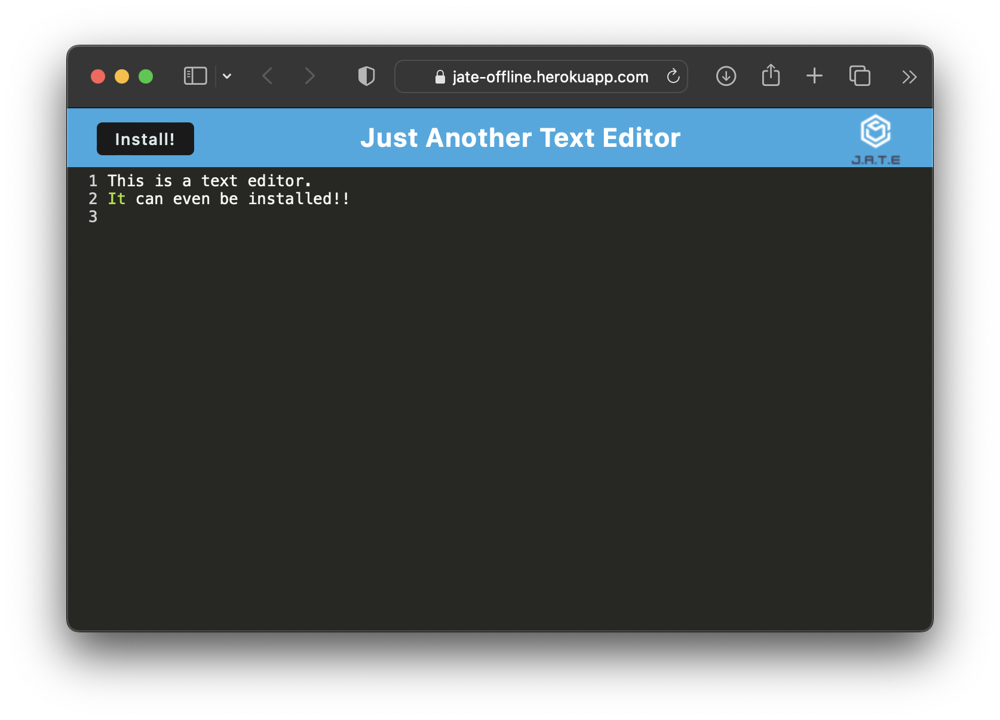

  # J.A.T.E. Offline 
  ## Description
  An installable text editor.
  ## Table of Contents
  - [Installation](#Installation)
  - [Usage](#Usage)
  - [Contributing](#Contributing)
  - [Tests](#Tests)
  - [Questions](#Questions)
  - [License](#License)
  ## Installation and Usage
  This app is designed to be deployed to a server and is accessed through a client browser. With supported browsers it can even be installed. The most important aspect is the service worker which allows it to run offline.
  ## Deployed
  Check out the deployed version of the app [here](https://jate-offline.herokuapp.com)!
  
  ## Questions
  If you would like to contact me or view other projects I'm working on, you can explore my repositories at [TheBluWiz](https://github.com/TheBluWiz), or email me at thebluwiz@icloud.com.
  ## License
  This project is under the MIT license attached in the repository.